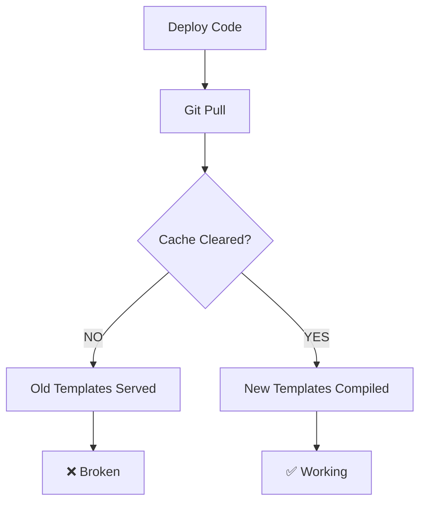

# Production Deployment Audit

**Issue:** Templates work in development but not in production.

**Root Cause:** OPcache + Template Cache not being cleared on deploy.

---

## 🔍 Problem Analysis

### Development (Works ✅)
```env
APP_ENV=development
APP_DEBUG=true
```

- OPcache invalidation: **ENABLED**
- Template cache: **DISABLED** (fresh templates every request)
- Result: Changes visible immediately

### Production (Broken ❌)
```env
APP_ENV=production
APP_DEBUG=false
```

- OPcache invalidation: **DISABLED**
- Template cache: **ENABLED** (compiled templates)
- Result: Old cached templates served

---

## 📋 Production Flow Audit

### Current Flow



### Missing Steps

Current deploy:
1. ✅ Git pull
2. ❌ **Clear template cache**
3. ❌ **Reset OPcache**
4. ❌ **Verify deployment**

---

## ✅ Solution: Production Deploy Script

### Create: `scripts/deploy-prod.sh`

```bash
#!/bin/bash

set -e

echo "🚀 Production Deployment"
echo "========================"

# 1. Pull latest changes
echo "📦 Pulling latest changes..."
git pull origin main

# 2. Install dependencies (if needed)
if [ -f "composer.lock" ]; then
    echo "📦 Installing PHP dependencies..."
    composer install --no-dev --optimize-autoloader --no-interaction
fi

# 3. Build frontend assets (if Templates/ exists)
if [ -d "src/Templates" ]; then
    echo "📦 Building frontend assets..."
    cd src/Templates
    pnpm install --production
    pnpm run build:prod
    cd ../..
fi

# 4. Clear template cache (CRITICAL!)
echo "🗑️  Clearing template cache..."
rm -rf storage/cache/templates/*
echo "✅ Template cache cleared"

# 5. Reset OPcache (CRITICAL!)
echo "🔄 Resetting OPcache..."
php -r "
if (function_exists('opcache_reset')) {
    opcache_reset();
    echo '✅ OPcache reset successful';
} else {
    echo '⚠️  OPcache not enabled';
}
echo PHP_EOL;
"

# 6. Set permissions
echo "🔒 Setting permissions..."
chown -R www-data:www-data storage/
chmod -R 755 storage/

# 7. Verify deployment
echo "✅ Verifying deployment..."
php -r "
require 'vendor/autoload.php';
echo '✅ Autoloader OK' . PHP_EOL;
"

# 8. Health check
echo "🏥 Running health check..."
curl -sf http://localhost:8000/ > /dev/null && echo "✅ Homepage OK" || echo "❌ Homepage FAILED"
curl -sf http://localhost:8000/contact > /dev/null && echo "✅ Contact OK" || echo "❌ Contact FAILED"

echo ""
echo "🎉 Deployment Complete!"
echo "======================="
echo ""
echo "Next steps:"
echo "1. Test critical pages manually"
echo "2. Monitor error logs: tail -f storage/logs/app.log"
echo "3. Check template cache: ls -la storage/cache/templates/"
```

### Make executable:
```bash
chmod +x scripts/deploy-prod.sh
```

---

## 🔄 Alternative: Git Hook (Auto-deploy)

### Create: `.git/hooks/post-receive` (on server)

```bash
#!/bin/bash

GIT_DIR=/var/www/nativa/.git
WORK_TREE=/var/www/nativa

git --git-dir=$GIT_DIR --work-tree=$WORK_TREE checkout -f main

cd $WORK_TREE

# Run deploy script
./scripts/deploy-prod.sh
```

---

## 📊 Cache Management

### Template Cache Locations

```
storage/
└── cache/
    └── templates/          ← Compiled PHP templates
        ├── a1b2c3d4.php    ← home.php compiled
        ├── e5f6g7h8.php    ← contact.php compiled
        └── ...
```

### When to Clear

| Scenario | Clear Template Cache | Reset OPcache |
|----------|---------------------|---------------|
| Template changes | ✅ YES | ✅ YES |
| Layout changes | ✅ YES | ✅ YES |
| Asset changes | ❌ No | ❌ No |
| PHP code changes | ❌ No | ✅ YES |
| Config changes | ❌ No | ✅ YES |

### Cache Version Strategy

**Option 1: Manual Version**

`.env.production`:
```env
# Update this on every deploy
TEMPLATE_CACHE_VERSION=20260301-1
```

**Option 2: Auto from Git**

`TemplateRenderer.php`:
```php
$cacheVersion = $_ENV['TEMPLATE_CACHE_VERSION'] 
    ?? trim(shell_exec('git rev-parse --short HEAD'));
```

**Option 3: Timestamp**

`deploy-prod.sh`:
```bash
echo "TEMPLATE_CACHE_VERSION=$(date +%Y%m%d-%H%M%S)" >> .env.production
```

---

## 🧪 Testing Checklist

After deploy, verify:

### 1. Template Cache
```bash
# Check cache exists
ls -la storage/cache/templates/

# Should see new .php files with recent timestamps
```

### 2. OPcache
```bash
# Verify OPcache is reset
php -r "echo 'OPcache enabled: ' . (function_exists('opcache_reset') ? 'YES' : 'NO') . PHP_EOL;"
```

### 3. Pages
```bash
# Test critical pages
curl -sf https://api.responsive.sk/ | grep -q "Nativa" && echo "✅ Homepage"
curl -sf https://api.responsive.sk/contact | grep -q "contact-hero" && echo "✅ Contact"
curl -sf https://api.responsive.sk/blog | grep -q "blog-hero" && echo "✅ Blog"
```

### 4. Logs
```bash
# Check for errors
tail -50 storage/logs/app.log | grep -i error

# Check template rendering
tail -50 storage/logs/app.log | grep "TemplateRenderer"
```

---

## 🚨 Common Issues

### Issue 1: Old templates still showing

**Symptom:** Changes to templates not visible

**Solution:**
```bash
# Clear cache
rm -rf storage/cache/templates/*

# Reset OPcache
php -r "opcache_reset();"

# Verify file permissions
ls -la storage/cache/templates/
```

### Issue 2: Permission denied

**Symptom:** `Permission denied` errors in logs

**Solution:**
```bash
# Fix permissions
chown -R www-data:www-data storage/
chmod -R 755 storage/
chmod -R 775 storage/cache/
```

### Issue 3: OPcache not resetting

**Symptom:** PHP code changes not visible

**Solution:**
```bash
# For PHP-FPM
sudo systemctl restart php8.4-fpm

# For Apache
sudo systemctl restart apache2

# Or use opcache_invalidate in code
```

---

## 📝 Deployment Log Template

```markdown
## Deploy [DATE]

**Commit:** [HASH]
**Deployed by:** [NAME]

### Changes
- [ ] Template changes
- [ ] PHP code changes
- [ ] Asset changes
- [ ] Config changes

### Steps Completed
- [ ] Git pull
- [ ] Dependencies installed
- [ ] Assets built
- [ ] Template cache cleared
- [ ] OPcache reset
- [ ] Permissions set
- [ ] Health check passed

### Verification
- [ ] Homepage loads
- [ ] Contact page loads
- [ ] Blog page loads
- [ ] No errors in logs

### Issues
[Any issues encountered]

### Rollback Plan
[If needed, how to rollback]
```

---

## ✅ Recommended: CI/CD Pipeline

For automated deploys, use GitHub Actions:

```yaml
# .github/workflows/deploy-prod.yml
name: Deploy to Production

on:
  push:
    branches: [main]

jobs:
  deploy:
    runs-on: ubuntu-latest
    steps:
      - uses: actions/checkout@v4
      
      - name: Deploy via SSH
        uses: appleboy/ssh-action@master
        with:
          host: ${{ secrets.PROD_HOST }}
          username: ${{ secrets.PROD_USER }}
          key: ${{ secrets.SSH_KEY }}
          script: |
            cd /var/www/nativa
            git pull origin main
            composer install --no-dev --optimize-autoloader
            rm -rf storage/cache/templates/*
            php -r "opcache_reset();"
            curl -sf http://localhost:8000/ > /dev/null
```

---

## 🎯 Next Steps

1. ✅ Create `scripts/deploy-prod.sh`
2. ✅ Test on staging server
3. ✅ Document in README
4. ✅ Train team on deploy process
5. ✅ Setup monitoring/alerts

---

**Last Updated:** 2026-03-01
**Status:** Ready for implementation
